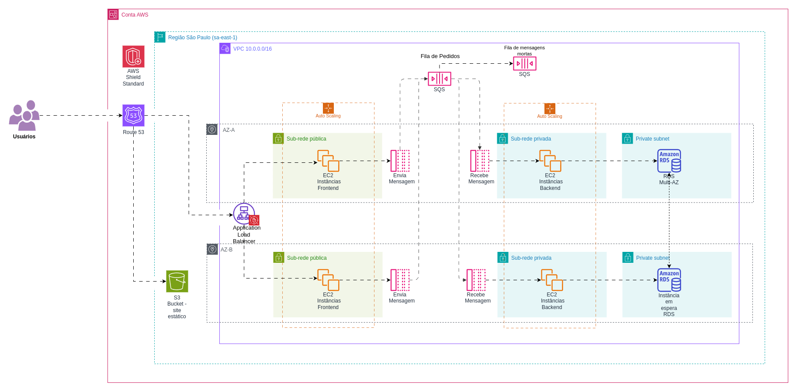

# Alta Demanda

Para um website cuja demanda esteja crescendo, com dimensionamento automático com uso do Auto Scaling no front e backend e com alta disponibilidade.

Apesar de ser uma arquitetura potencialmente com custo mais alto, a otimização de custo está no melhor uso da infraestrutura. 
Em vez de dimensionar verticalmente e manualmente as instâncias, usamos o Auto Scaling com instâncias menores e adicionamos ou reduzimos a quantidade de instâncias conforme a demanda.

#### [Editar uma cópia no diagrams.net (antigo draw.io)](https://viewer.diagrams.net/?tags=%7B%7D&lightbox=1&highlight=0000ff&edit=_blank&layers=1&nav=1&title=diagrama-alta-demanda.drawio#R%3Cmxfile%3E%3Cdiagram%20name%3D%22P%C3%A1gina-1%22%20id%3D%22BBM7HmE_G74GKGTS61Dw%22%3E7V1td5o%2BG%2F80nnPfL%2BwhPPtSUbdu69bVbmv3xoMQlQ6JA2x1L%2Fzs%2F4QHBRKRVkTn6HZac4EhJtfvek5sCNps%2Bc7V59MbZEK7wXPmsiF0GzzfBIIs47%2BEtApJgOcjysS1zJDGbQkD6w%2BMboypC8uEXkQLST5Ctm%2FN00QDOQ40%2FBRNd130kr5tjGwzRZjrE5gaBiEMDN2G1G0%2FLNOfhlSVV7b099CaTOMnA7kVXpnp8c1Rx95UN9FLgiT0GoLmIuSHr2ZLDdpk%2BtLz0t9xdTMwFzp%2BkTeg8e3N%2FQ9%2FcDu0fsv2TfPnu3upGX2MZ91eRB9YQ46vY1L7xyAat7%2BKJ2OOLMcPJlTq4P%2F4eRrXkPAVjbSueClDyLaVNAHQLdJHmpBtK2kCyHYPMs8H2QEmCFQr1T2XeT6XGCD%2BL3TQwrctB2ob1uMwceLqpoWXREM2cjHNQQ6evc7Un9m4BfDLl6nlw8FcN8isvmDgYNoYz3rE%2FICP29HEk14Nsir4WW7UDlYCur1nGC5IeI9t63PPGm3e5UJj4XrWM7yDXtg5oWJGnJPXs%2BWEoPZKf%2FHEq4mLFvNg%2BNf4WcyrQ90w0IIwW8fzXfQLxh%2BxwQtaFwNbJAO3bDvz0Z%2Bh61sYUW3bmpCefUQepEctG46DHvF8WM7kU9DqClw0B6xHmLo3hWb0YWgURMAgT4XLBClCxTuIZtB3V%2FiW6KrAc2L4nkhINcUIsi9bxANJirAyTcBdlSJppkdiZrLpfYtE%2FCIC4yuACQQKmXdwYjU0odEWEL4w2L681Rc2%2Bfs%2FT29C3fOb4P81dGvoJqHrYt4h12jkclxbbMsZ5JpwjHnKLw%2B8QFR6nXYSvKAk8AoApMCL14DCrtBiYFeRweHYvf2B%2Foju4E%2FPmX3rf%2B5YA%2B5h1qSh2%2BDlYDZH%2BMWEvPjmLQL8AtdCXnwVP2xzAwVg7xf0jekOHgIhb4T2BZeVkQkGTi9%2FxOC2PoL2LfIsP%2BCRrgFJ54nF%2F5S5YYR8H812cgcTXDHLbDrP8jIajy0DXi086Hrh7wxTYjZqyyrXUcvhHL6lqGnOiU23BOsoHINxuMP5xrHA4qndRvrTw2r62H3y5%2BB7UwIU4wRWGDeYWhDbrfiFrzum7poUdySWGOEpGNsBJ4xsZPwibEf%2BDkKQvkKSeZt3cCzJMQ5%2BNle%2BkLt9MpeACyQYthXMDdT1kYfshQ%2FbrhE%2FglC3LZ5e7W5XEEVt84DY%2FuauCAfYC8Myr0n31qi3Xnx8NK70p3tyMwWUrNpjqj6W%2BmOqQFoNpm4LFBPjCVkii6bQREDfFusymsiisRR39t2A8W6QefdutZkR9fhfnzB9Wga9UZRklanuzcMHj60l6ZutEV3ooYVrwFAfYl3qsTSjF6KK1tAR39%2BTEXT5soxMIS1tRJESNhJD2EglCBu250e7flj36DMy687Imwcfm2v%2FbLbzVVGFltTbHZdn3cJKzrKxfBr%2BCcdCiTNJlDpHdmE2jyjdChIFLsVdmETwnDWEeImnWQyox%2BIxmdtpCZGZCcI28eTIvxcoNHwEGf9gxZIghTbR91s8DA5wV8E%2FPCIgJ0ynsMcd1lPt%2FpyD%2BwNO5f48zw2ehXlVE%2Fv9%2FlEx3253lMBkLT1sIcppzMcKJgl4oLZowMsxsXQLVmQplQwUoWO2SWCW%2BAK27nmWkWayrd1IJgqaExizE3L9KZogR7d7W2pnhp71kHFAqOutP8k28nU%2F0TahDZNtaFrJJjGUN8%2BOYsqJy8SubjvWTI%2BsF7b4zpWF5APlLm9Bg8CFNh7FczpMzVrQ6Am3BHdb7pE44UpM%2FAjpEJgipjsM7amoj2SQOdOtrICrFi%2FziiBKKu62lbZ5lHSvvu5OoE%2F1itlDXyVui4R33mdhPWbLyGGHW7bezPbbOV2gnfw%2BtjFIqgOSkBzmKxN5x%2FfTBKZrneO4OUnzJ%2BuzETFYvh%2BXcRR3%2BXGI19bvF5Pfc%2FRCPgTajIMVRXsl6oqLVVFKMxOg7XTASTQuBf5wmcqMJjEiwbRMtW1r7sEd%2FJJgOsp%2FYkf9mCxDbo1FMWYCMujjLUMTSBnlBhgGLa%2FSCxHTSlduPLUOg8Wo6cIA8HMSzuu0RzY2GWrrs7Y%2Bk9anR7ojruf25kEAMKaAxgJTabcByMbkMb3P9%2BWeWp5tyouqCgqk1ErCNIglV%2BykcjKNaJbNA8qIgjAxLedi2rWedbOGcw3nw%2BDMTLFhek%2Fuy32lPDjTSbajwlkWpHODM6ADTrcExD6Bs7cYOdCv0VyjuUYzjeZWHEM4HzTzIoXmuy7Jh95gL8Vqtn8e373elwbN9aYP95yFjqhq%2BzOgw1F3PXxQltcv11YjkwF9VcpuB84ryeTtqGlgZPdMb2g5nq87ZNXekr3L1x2FIaNm4q8KBZi4PCwVwBOPBJe4ECZZPvCzuaeSpE7flZ%2B%2BKysEwmeip3EXqYyeyAjwl5LRY%2FNYHQSp7aw6CHJQECSbrFBZgc2K%2FSY6xlzHQWpE155TEUTLgnyGiKZ9pzoSUuO5xnORSAh%2FfnjmGc7dwg82AuEJJuGJo8RCdjOTFhcb5HpueIhDLxwgi61AbrggWQquSH2gUN69xPD%2FD8FOEqdYFuwJ%2FuBxmaosBzUYReopSq6mSHmhY2vZxe2oRS7d6j6eBjKjWD1x0t4g0ucP2lp%2FaH55Xr37cFR1KaUDjYBRt7bZ%2FpsKnMQlAYeA6%2BVdz3cX6i%2F09Wnx3Z75hn1tNYFKoWd%2F3Vm6Tm17zycU8CZZhifo%2B6toKQkU0oqihGKysCwrT2xEhn1YaZV3YzS3e8vTCtedHSbuaIekpxHCteP5wc4p3jEs%2FFie6%2BjGL%2BiYx5F%2FZxQL7nWVsKt8GD852hqaHx%2Ft2zm1G%2BbyYsFxHNhjKIICgeCSRJqS8QAkQIu0Y23uYMOnRfvzX0nm5PJRogBJ6exFCbzV1h%2B%2FXNsWbHKXj5LfC7h4Y6qkrKpKJa30ZTq5KB%2BpqJJdvkub0z3n2SL1uzfQ8fQJnNVQCaEyudPWvTYY%2BjK3vnyozKDnBUfCnBAsgpreKlilOmHbx%2FKl2sexgNlvHwtnZR%2FH404dD2LAEawFGFOASa568%2B3z1KsFWBUCTJLTEbST28MCXeebh46kXAJqASAIFOuT4p3gZyf%2Fs5g2g4kN9%2FMkP7lf5GJfyPXjzXURdya228VIx6S%2BZccfFi4t%2FyEYQUsRo%2FZj0Jai1i10LbwOG0bC7OKuHpKNxP2kmX3DFoui2V1LNyv5g%2FMJVSXi42Pj9or4VkERn9oKxIoCx8TX7dHbve0txftlbF4rsE3zX4cDODYUprC7VnzdXvofOhVBIebwvVCIzYt%2FAApqHSnJtZ46dnc9eFijr55gXL71dPpIiSynY4mx%2BjpVpESkQ4nJjc6z0NlwSCR%2BhsWwXsGe54C3%2F8E9z1PkWn8ILZ7O4zFhduM%2BxYMtRtkprxyJB2O%2FIM9eibPLGT5I4raMKducNBydCtFIHubLDOakA58CK%2FLJcoWOhWeedoXa8zmp2A1kLc99QroZpNVsklhxjwNnpvDVt%2BMY2ngUw1E8hkPOKKQkBVuHsFQEZdPmFwPssXAPFypySzCM%2FZn8D5a2Xn25H0Lp4ZEhRmgI5INuv9Q4WZrrdX5Myexa7JS5F31cBfvuPp3xrYxdPvuaMi%2Fy5l72%2Fb7uriV0821xLwmVsG8sqdOGF88oSxEZSu9Y23l42jOpU1RsjvnxRVsvZcQpA86%2BfB%2FlHCK82RQVL9IVktVGeOl65zx0%2FJMhrW0Y6zFimJJDWj1JW%2Fe%2BLef3UCe1R5WEtCI%2BrKO7W4%2B9zg3WmuNsNYekcHE1%2FdnoDqnWHeWkQ7bA%2BopVwQ%2Fh%2FfO3z8qwKlVQNLsRC8jzVQX0EZetHfbWnqM0y9IpPA2RdCU2mc4Z%2BYWFk0tawUkdF65kCh7PYRvdtdaytYc5VC9fyRx%2BPEdZO605Lh17lQAdez3WCR3sOroWBYkK6uhS%2B4RSSmB7%2FnJAToj9SuS1WNR0P9neFOYq8gWyEZd4IGv63AKhRZ9GUulxrHTst94QWW%2BIrHJD5OuP7Jcz3zQIFMbG4or3Pgqn0EnF9AsoqEkKx4DUUymSvGEX2OPYdzEO602OG2gKM209VuCvx3cr5fIt6gM3Ob5BTKlpMcWrAm04V7oBRfr7hVTh2ktwVkKKLv%2BqhVS9E%2FsMhZQkMbz7SoWU8vcLqdiV3W9KiWclpeJx1%2BdF1KbUOUkpEbT4MzOlxL9fSomFpVTRTE81kUP60IE7DDGSl5doL7z%2BHuMU7XTfY5yRq5vvjNxdclmGzKPqPpNo2nOcYJnfkuwSDh1KjCrRKr4lGSj0d7JXKi4ZB%2BMKxIhYYCOC5GebBLRWgGEYWRoAryaq4fyXwHlzzPS%2FAWdvJ5CjAziZu2Yiwl0EOG6H9VuGBBAyEkCSTiwBzvhswMJenVzQXio9Pr6n3oVd7CJsEvWbPZB8ZhkP%2B0ZX5jqfJDd%2FonUuWgtb8TpLSrnf3MtO3xeoFD%2Bj9P0bbKiWlJlVevvmsTL1zBk%2FyelR7KL3%2BEp32dhWwHdXicary%2BG3XQWtVbKV7ezNcM9zJ5Noz7Nhz8QJZpQSXhT%2B%2BFa8NzrWXnx1lTLsGS9w%2BtHfPOMCaGWOlK6wNok54ydJV56HpGJ%2BhznjFOo8iXYukoou0Lgs3Ahx%2Ffq54OYkGbT8LQ5vsBSa3BXHCRkQymdpL%2BS6EUeHIW66CPlJ%2B55EKm6QCckd%2FwE%3D%3C%2Fdiagram%3E%3C%2Fmxfile%3E)

## Vantagens

* Maior controle da infraestrutura e cargas de trabalho flexíveis.

* Recursos fracamente acoplados. 

* Performance consistente.

* Custos menos imprevisíveis em boa parte do uso da infraestrutura.

* Custo menor para demandas fixas, em relação a arquiteturas serverless.

## Desvantagens

* Maior sobrecarga operacional para gerenciar a infraestrutura.

* Custos fixos devido a capacidade de infraestrutura provisionada, mesmo sem estar em uso.

* Tolerância a falhas menor, se comparada a uma arquitetura serverless, por não distribuir as cargas de trabalho automaticamente para outras regiões.

